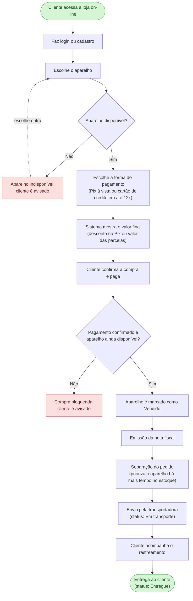
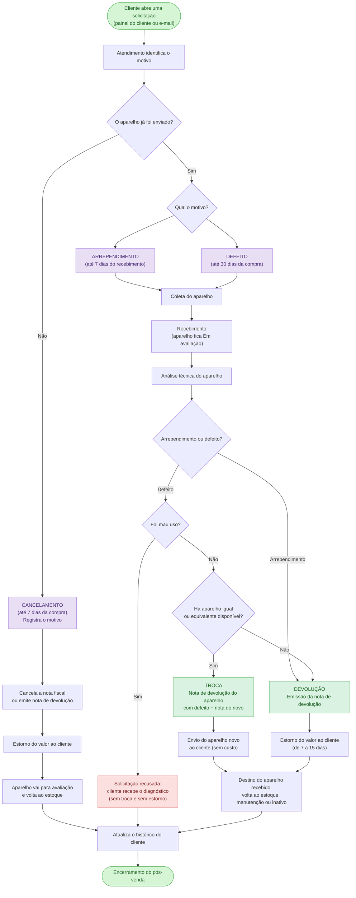
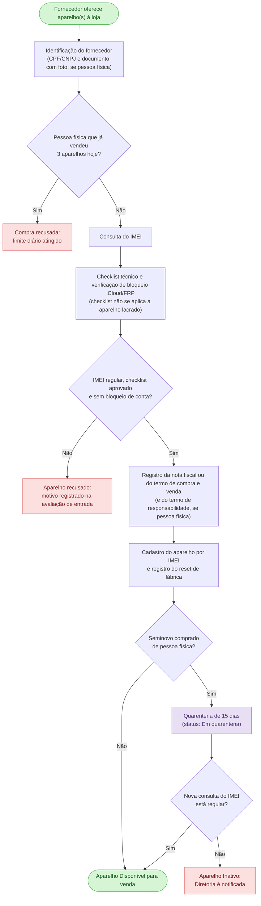

# CellGO — Fluxogramas

> Cópia da seção 4.2 do [README principal](../../README.md).

### 4.2 Fluxogramas

#### Fluxo de Venda

```mermaid
flowchart TD
    A1(["Cliente acessa a loja on-line"]):::startEnd
    B1["Faz login ou cadastro"]
    C1["Escolhe o aparelho"]
    D1{"Aparelho disponível?"}
    E1["Aparelho indisponível:<br/>cliente é avisado"]:::red
    F1["Escolhe a forma de pagamento<br/>(Pix à vista ou cartão de crédito em até 12x)"]
    G1["Sistema mostra o valor final<br/>(desconto no Pix ou valor das parcelas)"]
    H1["Cliente confirma a compra e paga"]
    I1{"Pagamento confirmado e<br/>aparelho ainda disponível?"}
    J1["Compra bloqueada:<br/>cliente é avisado"]:::red
    K1["Aparelho é marcado como Vendido"]
    L1["Emissão da nota fiscal"]
    M1["Separação do pedido<br/>(prioriza o aparelho há mais tempo no estoque)"]
    N1["Envio pela transportadora<br/>(status: Em transporte)"]
    O1["Cliente acompanha o rastreamento"]
    P1(["Entrega ao cliente<br/>(status: Entregue)"]):::startEnd

    A1 --> B1 --> C1 --> D1
    D1 -- Não --> E1
    E1 -. escolhe outro .-> C1
    D1 -- Sim --> F1 --> G1 --> H1 --> I1
    I1 -- Não --> J1
    I1 -- Sim --> K1 --> L1 --> M1 --> N1 --> O1 --> P1

    classDef startEnd fill:#d5f5d5,stroke:#4caf50,color:#1b5e20;
    classDef red fill:#fbe0df,stroke:#e57373,color:#7a1f1f;
```

#### Fluxo de Pós-venda

```mermaid
flowchart TD
    A2(["Cliente abre uma solicitação<br/>(painel do cliente ou e-mail)"]):::startEnd
    B2["Atendimento identifica o motivo"]
    C2{"O aparelho já foi enviado?"}
    D2["CANCELAMENTO<br/>(até 7 dias da compra)<br/>Registra o motivo"]:::purple
    E2["Cancela a nota fiscal<br/>ou emite nota de devolução"]
    F2["Estorno do valor ao cliente"]
    G2["Aparelho vai para avaliação<br/>e volta ao estoque"]
    H2{"Qual o motivo?"}
    I2["ARREPENDIMENTO<br/>(até 7 dias do recebimento)"]:::purple
    J2["DEFEITO<br/>(até 30 dias da compra)"]:::purple
    K2["Coleta do aparelho"]
    L2["Recebimento<br/>(aparelho fica Em avaliação)"]
    M2["Análise técnica do aparelho"]
    N2{"Arrependimento ou defeito?"}
    O2{"Foi mau uso?"}
    P2{"Há aparelho igual<br/>ou equivalente disponível?"}
    Q2["Solicitação recusada:<br/>cliente recebe o diagnóstico<br/>(sem troca e sem estorno)"]:::red
    R2["TROCA<br/>Nota de devolução do aparelho<br/>com defeito + nota do novo"]:::green2
    S2["DEVOLUÇÃO<br/>Emissão da nota de devolução"]:::green2
    T2["Envio do aparelho novo<br/>ao cliente (sem custo)"]
    U2["Estorno do valor ao cliente<br/>(de 7 a 15 dias)"]
    V2["Destino do aparelho recebido:<br/>volta ao estoque, manutenção ou inativo"]
    W2["Atualiza o histórico do cliente"]
    X2(["Encerramento do pós-venda"]):::startEnd

    A2 --> B2 --> C2
    C2 -- Não --> D2 --> E2 --> F2 --> G2 --> W2
    C2 -- Sim --> H2
    H2 --> I2 --> K2
    H2 --> J2 --> K2
    K2 --> L2 --> M2 --> N2
    N2 -- Arrependimento --> S2
    N2 -- Defeito --> O2
    O2 -- Sim --> Q2 --> W2
    O2 -- Não --> P2
    P2 -- Sim --> R2 --> T2 --> V2 --> W2
    P2 -- Não --> S2
    S2 --> U2 --> V2
    W2 --> X2

    classDef startEnd fill:#d5f5d5,stroke:#4caf50,color:#1b5e20;
    classDef purple fill:#e8dff5,stroke:#9c6ade,color:#4a2c73;
    classDef red fill:#fbe0df,stroke:#e57373,color:#7a1f1f;
    classDef green2 fill:#d9f2e1,stroke:#4caf50,color:#1b5e20;
```

#### Fluxo de Aquisição de Aparelhos

```mermaid
flowchart TD
    A3(["Fornecedor oferece aparelho(s) à loja"]):::startEnd
    B3["Identificação do fornecedor<br/>(CPF/CNPJ e documento com foto, se pessoa física)"]
    C3{"Pessoa física que já vendeu<br/>3 aparelhos hoje?"}
    D3["Compra recusada:<br/>limite diário atingido"]:::red
    E3["Consulta do IMEI"]
    F3["Checklist técnico e verificação de bloqueio iCloud/FRP<br/>(checklist não se aplica a aparelho lacrado)"]
    G3{"IMEI regular, checklist aprovado<br/>e sem bloqueio de conta?"}
    H3["Aparelho recusado:<br/>motivo registrado na avaliação de entrada"]:::red
    I3["Registro da nota fiscal ou do termo de compra e venda<br/>(e do termo de responsabilidade, se pessoa física)"]
    J3["Cadastro do aparelho por IMEI<br/>e registro do reset de fábrica"]
    K3{"Seminovo comprado<br/>de pessoa física?"}
    L3["Quarentena de 15 dias<br/>(status: Em quarentena)"]:::purple
    M3{"Nova consulta do IMEI<br/>está regular?"}
    N3["Aparelho Inativo:<br/>Diretoria é notificada"]:::red
    O3(["Aparelho Disponível para venda"]):::startEnd

    A3 --> B3 --> C3
    C3 -- Sim --> D3
    C3 -- Não --> E3 --> F3 --> G3
    G3 -- Não --> H3
    G3 -- Sim --> I3 --> J3 --> K3
    K3 -- Não --> O3
    K3 -- Sim --> L3 --> M3
    M3 -- Sim --> O3
    M3 -- Não --> N3

    classDef startEnd fill:#d5f5d5,stroke:#4caf50,color:#1b5e20;
    classDef purple fill:#e8dff5,stroke:#9c6ade,color:#4a2c73;
    classDef red fill:#fbe0df,stroke:#e57373,color:#7a1f1f;
```
